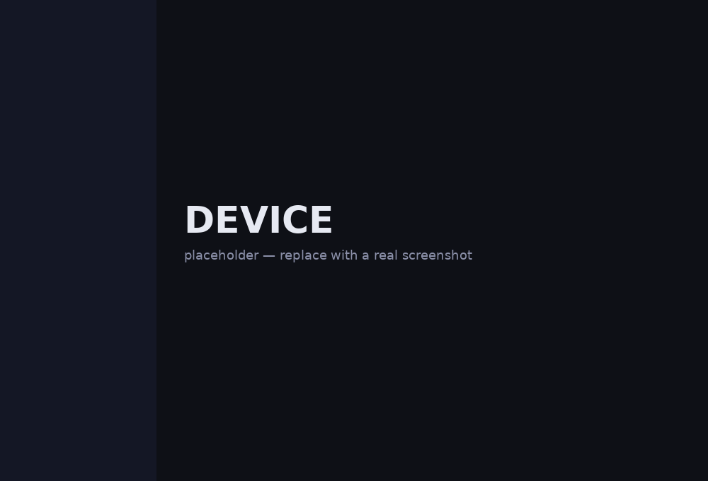
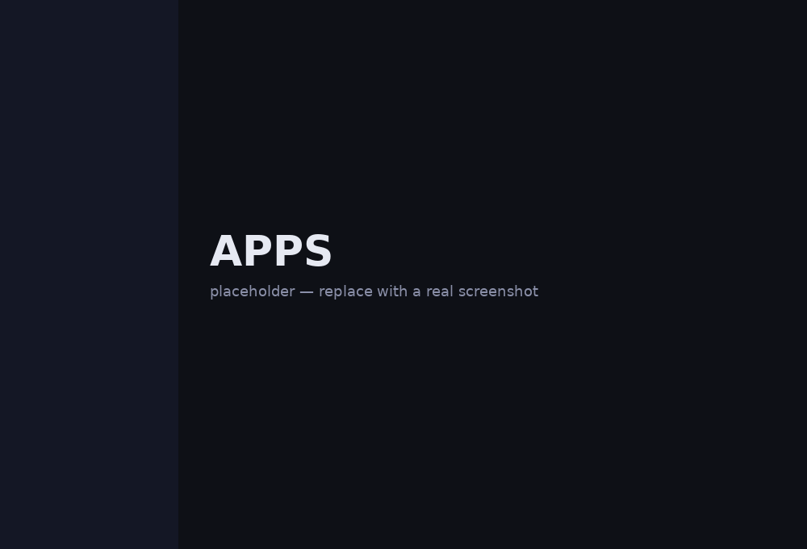
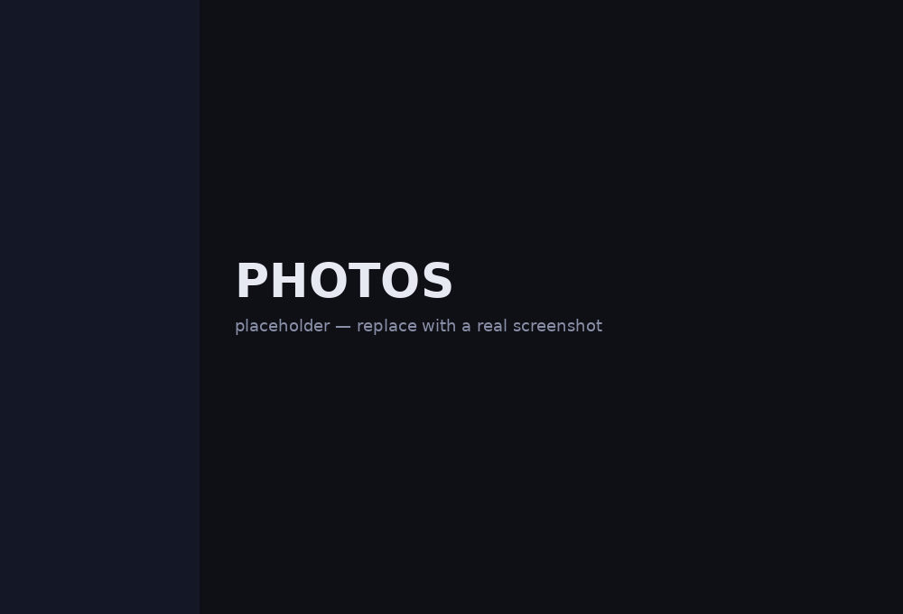
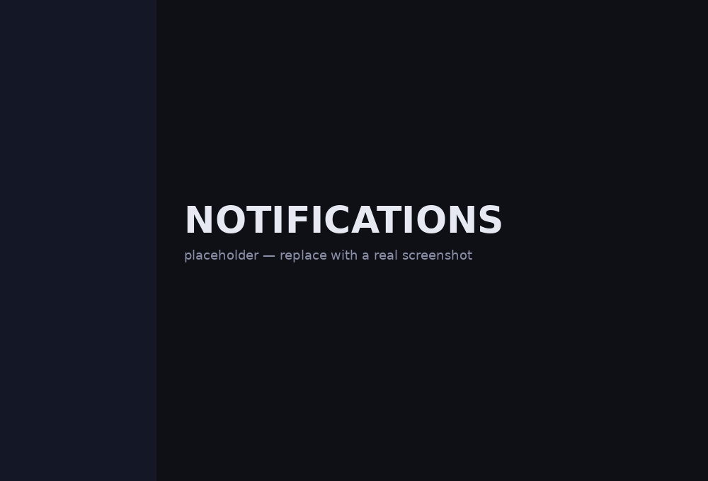

<div align="center">

# linkdrop

**Connect your iPhone to Linux, macOS, or Windows. Photos, files, apps, backups, and screen mirror — in one native app.**

A cross-platform Phone-Link-for-iPhone, built around `pymobiledevice3`.
Tauri + Rust on the backend, React on the front. No Mac bridge required
on Linux/Windows. No jailbreak. No cloud.

[](https://github.com/joemunene-by/linkdrop/actions/workflows/release.yml)
[](https://github.com/joemunene-by/linkdrop/releases/latest)
[](https://github.com/joemunene-by/linkdrop/releases)


</div>

---

## Quick start (~5 min)

```bash
# 1. One-time runtime deps (Linux example; macOS/Windows below)
sudo apt install libimobiledevice-utils usbmuxd uxplay pipx
pipx install pymobiledevice3

# 2. Download the .deb from the latest release
#    https://github.com/joemunene-by/linkdrop/releases/latest
sudo dpkg -i ~/Downloads/linkdrop_*_amd64.deb

# 3. Plug iPhone in, unlock, tap Trust — then:
pymobiledevice3 lockdown pair     # one-time: trust + passcode on iPhone

# 4. Launch linkdrop from the app launcher. Done.
```

macOS: `brew install libimobiledevice pipx && pipx install pymobiledevice3`,
then double-click the `.dmg`. Windows: install iTunes (for Apple Mobile
Device Service) + Python, then the `.msi`. Full per-OS breakdown below.

## Screenshots

<!-- Drop real screenshots at the paths below after next run. -->
<p align="center">
  
  
</p>
<p align="center">
  
  
</p>

## What it does

- **Device info** — name, model, iOS version, serial, battery, storage
- **Photos** — browse DCIM via AFC, per-photo download, bulk "Download all"
- **Apps** — installed-app list, file-sharing sandbox browser (Documents/), install `.ipa`, uninstall
- **Screenshots** — one click, DDI auto-mounts behind the scenes
- **Notifications tail** — iOS syslog filtered by regex, savable to file
- **Crash reports + Sysdiagnose** — list, pull, export for Apple Feedback
- **iOS backup** — full MobileBackup2 backup to a folder of your choice
- **Screen mirror** — AirPlay receiver (Linux: `uxplay`; macOS uses built-in)
- **Wi-Fi discovery** — device shows up in the picker once paired, cableless

Every op works on both USB and Wi-Fi. One codepath, all platforms.

## Supported iOS versions

| iOS range | Device info | Photos | Screenshot | Apps / browser | Wi-Fi sync | Mirror |
|---|---|---|---|---|---|---|
| **iOS 12 – 16** (tested: 15.8.7 / iPhone 6s) | ✅ | ✅ | ✅ classic DDI | ✅ | ✅ | ✅ |
| **iOS 17+** | ✅ | ✅ | ✅ Personalized DDI *(first mount auto-downloads ~1.4 GB)* | ✅ | ✅ | ✅ |
| iOS 10 – 11 | ⚠️ USB only (pymobiledevice3 ≥ 12) | ⚠️ USB only | ⚠️ | ⚠️ | ❌ | ✅ |
| iOS ≤ 9 | ❌ (libimobiledevice doesn't pair cleanly) |

Hardware: **iPhone 5s or newer** (A7+), all iPads. USB-C iPhones (15/16) work identically to Lightning.

Screenshot uses a Developer Disk Image that's specific to the iOS major version:
- **iOS < 17:** classic DMG + signature. linkdrop looks first in `~/linkdrop/ddi/` (drop your own files there for offline use); otherwise pymobiledevice3 fetches from its repo into `~/Xcode.app/…/DeviceSupport/<ver>/`.
- **iOS ≥ 17:** Personalized DDI. pymobiledevice3 fetches `Image.dmg` + `BuildManifest.plist` + trustcache once into `~/Xcode_iOS_DDI_Personalized/` and mounts from there.

Either way it's automatic — just click **Take screenshot** and it handles mounting if needed.

## Wi-Fi sync

Click **Enable Wi-Fi sync** in the Device panel while USB-connected — linkdrop flips iPhone's `EnableWifiConnections` lockdown flag through the pmd3 daemon. One-time setup. After that, the iPhone shows up in the picker whenever it's on the same Wi-Fi: Device Info, Screenshot, Apps, Photos, and Notifications all work cableless. Developer Disk Image auto-mounts from `~/linkdrop/ddi/` (override with `LINKDROP_DDI_DIR`) whenever it's missing — iOS forgets the mount on reboot, so linkdrop quietly re-uploads it the first time you take a Wi-Fi screenshot after the iPhone restarts.

## What it deliberately doesn't do

Apple keeps a few things locked on non-Apple platforms. Rather than fake them, linkdrop is explicit about what's out of scope:

- **iMessage / SMS** — Apple only exposes iMessage through Handoff/Continuity (macOS only) or via a Mac relay (AirMessage). There's no clean Linux path.
- **Outbound calls** — same constraint.
- **Real-time notification push** — `idevicesyslog` can surface *some* events, but it's not reliable enough to ship as a feature.

If these are critical to you, you need a Mac in the loop. If they're not, linkdrop covers the rest nicely.

## Install

### From a release (fastest)

1. Install the [runtime tools](#runtime-tools-all-platforms) below (one-time).
2. Grab the installer for your OS from
   **[latest release](https://github.com/joemunene-by/linkdrop/releases/latest)**:
   - Linux: `linkdrop_<ver>_amd64.deb` (`sudo dpkg -i`) or `.AppImage` (chmod +x, run).
   - macOS: `linkdrop_<ver>_x64.dmg` (Intel) or `linkdrop_<ver>_aarch64.dmg` (Apple Silicon).
   - Windows: `linkdrop_<ver>_x64_en-US.msi` or `.exe` (NSIS).

### Runtime tools (all platforms)

linkdrop drives a small Python helper that calls `pymobiledevice3` for
everything iPhone-related. One toolchain, three OSes:

**Linux (Debian / Ubuntu)**

```bash
sudo apt install libimobiledevice-utils usbmuxd uxplay pipx
pipx install pymobiledevice3
```

**macOS**

```bash
brew install libimobiledevice ideviceinstaller pipx
pipx install pymobiledevice3
```

(macOS ships its own usbmuxd via Apple Mobile Device Service — nothing else
to start. AirPlay is handled natively by macOS itself, so the Screen Mirror
tab uses an AirPlay receiver only if you have one installed; otherwise the
system picker works fine.)

**Windows**

Install iTunes from Apple (ships Apple Mobile Device Service — linkdrop's
USB path talks to that). Then:

```powershell
winget install Python.Python.3.12
python -m pip install --user pipx
python -m pipx ensurepath
pipx install pymobiledevice3
```

### Optional: Linux-only Wi-Fi discovery via netmuxd

Linux users can drop in [netmuxd](https://github.com/jkcoxson/netmuxd) so
Wi-Fi-only iPhones show up in linkdrop's picker without pymobiledevice3's
per-call Bonjour browse. Not required — linkdrop's own listing already
browses via Bonjour on every platform.

```bash
curl -L -o /tmp/netmuxd https://github.com/jkcoxson/netmuxd/releases/latest/download/netmuxd-x86_64-linux-gnu
sudo install -m 0755 /tmp/netmuxd /usr/local/bin/netmuxd
```

`/etc/systemd/system/netmuxd.service`:

```ini
[Unit]
Description=netmuxd — Wi-Fi iPhone discovery
After=avahi-daemon.service

[Service]
ExecStart=/usr/local/bin/netmuxd --disable-unix --disable-heartbeat --host 127.0.0.1 -p 27015
Restart=on-failure

[Install]
WantedBy=multi-user.target
```

…then `sudo systemctl enable --now netmuxd`.

### Build dependencies (required to compile from source)

Tauri needs GTK + WebKit + a C toolchain on Linux:

```bash
sudo apt install build-essential curl wget file libssl-dev \
  libgtk-3-dev libwebkit2gtk-4.1-dev libxdo-dev \
  libayatana-appindicator3-dev librsvg2-dev
```

After installing, plug your iPhone in and tap **Trust** when it prompts.

## First-run: pair your iPhone

linkdrop uses `pymobiledevice3`'s pair records (under `~/.pymobiledevice3/`).
The very first time you connect an iPhone you need to create one:

1. Plug iPhone in via USB, **unlock it**, keep the screen on.
2. Run:
   ```bash
   pymobiledevice3 lockdown pair
   ```
3. A **Trust This Computer?** prompt appears on the phone — tap Trust, enter passcode.
4. Launch linkdrop; the iPhone shows up in the picker tagged `USB`.
5. In the Device tab, click **Enable Wi-Fi sync** — now unplugging the cable keeps the device visible on the same Wi-Fi.

If the phone ever stops authenticating (`PAIRED:False` in pymobiledevice3 output, or
"device not found" errors in linkdrop despite mDNS working) the pair record is
stale — delete it and re-pair:

```bash
rm ~/.pymobiledevice3/<UDID>.plist
pymobiledevice3 lockdown pair
```

> **iOS USB Restricted Mode** cuts USB data ~2 s after the screen locks. If pairing
> or Wi-Fi-sync activation fails with `BadDev`, toggle *Settings → Touch ID (Face ID) &
> Passcode → USB Accessories → ON* on the phone so data stays alive while locked.

## Build and run

```bash
# 1. Clone and install frontend deps
git clone https://github.com/joemunene-by/linkdrop.git
cd linkdrop
bun install

# 2. Install Rust (one-time, if you don't have it)
curl --proto '=https' --tlsv1.2 -sSf https://sh.rustup.rs | sh -s -- -y

# 3. Dev mode (hot-reload frontend + rebuild Rust on save)
bun run tauri dev

# 4. Production bundle (.deb / .AppImage under src-tauri/target/release/bundle)
bun run tauri build
```

## Architecture

```
┌──────────────────────────────────────────┐
│  React UI (src/)                         │
│  - device picker (15 s non-overlap poll) │
│  - tabs: Device / Photos / Apps /        │
│    Mirror / Notifications / Diagnostics  │
│    / Settings                            │
│  - theme toggle, file pickers            │
└────────────────┬─────────────────────────┘
                 │ Tauri IPC (invoke)
┌────────────────▼─────────────────────────┐
│  Rust backend (src-tauri/src/)           │
│  - pmd3.rs  → daemon manager +            │
│    line-per-request JSON IPC              │
│  - airplay.rs → uxplay (iOS mirror)       │
│  - notifications.rs → idevicesyslog       │
│    streaming as Tauri events              │
└────────────────┬─────────────────────────┘
                 │ stdin / stdout JSON lines
┌────────────────▼─────────────────────────┐
│  pmd3_helper.py daemon (pymobiledevice3) │
│  - _LOCKDOWN_CACHE: udid → session        │
│  - one-shot CLI mode preserved            │
│  - cmd_list / info / screenshot / apps /  │
│    photos / crash / backup / sysdiagnose  │
│    / install / uninstall / push / pull    │
└──────────────────────────────────────────┘
```

One Python interpreter runs for the app's lifetime, one pair-verified
lockdown session per device stays warm. Per-op latency after the first
listing: ~100–500 ms instead of 1–5 s. In-flight guard on the 15 s
auto-poll stops calls from stacking up and freezing the webview.

Devices are sticky for 60 s after their last mDNS sighting, so the
picker doesn't flicker through Bonjour's bursty announcement windows.

### Daemon protocol

Each Tauri command serializes to one JSON line on the daemon's stdin,
and reads one matching-`id` response line from stdout:

```jsonc
// → list every paired device
{"id": 1, "op": "list", "args": []}
// ← fast path (session cache primed)
{"id": 1, "ok": true, "data": [
  {"udid": "f3712b615c...", "transport": "wifi"}
]}

// → fetch device info
{"id": 2, "op": "info", "args": ["f3712b615c..."]}
{"id": 2, "ok": true, "data": {
  "udid": "f3712b615c...", "name": "iPhone",
  "product_type": "iPhone8,1", "ios_version": "15.8.7",
  "battery_percent": 64,
  "total_bytes": 64000000000, "free_bytes": 22681038848
}}

// → error example: stale pair record / mDNS gap
{"id": 3, "op": "apps", "args": ["..."]}
{"id": 3, "ok": false, "error": "device ... not found on USB or Wi-Fi"}
```

You can drive the daemon by hand with
`echo '{"id":1,"op":"list","args":[]}' | python src-tauri/scripts/pmd3_helper.py daemon` —
useful for scripting outside the app or debugging a specific command.

## CI / Release pipeline

`.github/workflows/release.yml` builds on every push to `main` and on every
`v*` tag. Matrix targets: Ubuntu 24.04 (x86_64), macOS 13 (x86_64),
macOS 14 (aarch64), Windows latest (x86_64). Each job runs
`bun run tauri build` and uploads its native bundles as a CI artifact
(`.deb`/`.rpm`/`.AppImage` on Linux, `.dmg`/`.app` on macOS, `.msi`/`.exe`
on Windows). On a tag, `softprops/action-gh-release` attaches all
artifacts to the corresponding GitHub Release automatically — no manual
cutting. Cargo registry + target are cached between runs so non-tag PRs
turn around in a couple minutes.

Badges at the top of this README reflect the live pipeline state, the
latest shipped tag, and cumulative download count from the Releases page.

## Roadmap

- ~~**v0.2** — Wi-Fi pairing + dual-transport device picker~~ ✅
- ~~**v0.3** — Notifications tab tailing `idevicesyslog`~~ ✅
- ~~**v0.4** — Apps tab + per-app sandbox browser via `house_arrest`~~ ✅
- ~~**v0.5** — AppImage + .deb via `bun run tauri build`~~ ✅
- ~~**v0.6** — Wi-Fi-complete ops, DDI auto-mount, photo bulk pull, crash logs, backups, app install/uninstall, macOS + Windows builds, GitHub Actions matrix, Settings + theme, first-run wizard~~ ✅
- ~~**v0.7** — pmd3 daemon, sticky device list, native file pickers, cross-platform bundles~~ ✅
- **v0.8** — Android via `adb` / `scrcpy` (dual-platform picker, branch exists in commit `14c35cf`)
- **v0.9** — Flatpak / Snap / AUR, inline photo thumbnails, signed macOS + Windows artifacts

## Related projects

Built by [@joemunene-by](https://github.com/joemunene-by). Other recent work:

- [`secure-mcp`](https://github.com/joemunene-by/secure-mcp) — MCP server exposing security tools with policy gates
- [`cyberbench`](https://github.com/joemunene-by/cyberbench) — LLM cybersecurity reasoning benchmark
- [`GhostLM`](https://github.com/joemunene-by/GhostLM) — cybersecurity-focused LLM

## License

MIT. See [LICENSE](./LICENSE).

---

<sub>Not affiliated with Apple Inc. "iPhone" and "AirPlay" are trademarks of Apple Inc.</sub>
